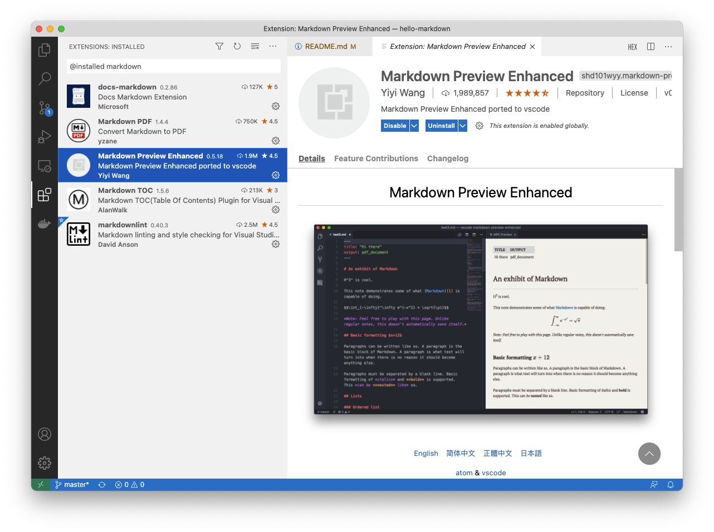
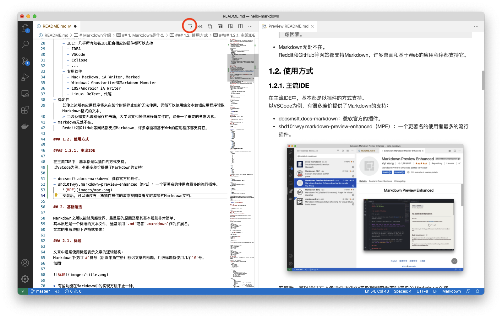
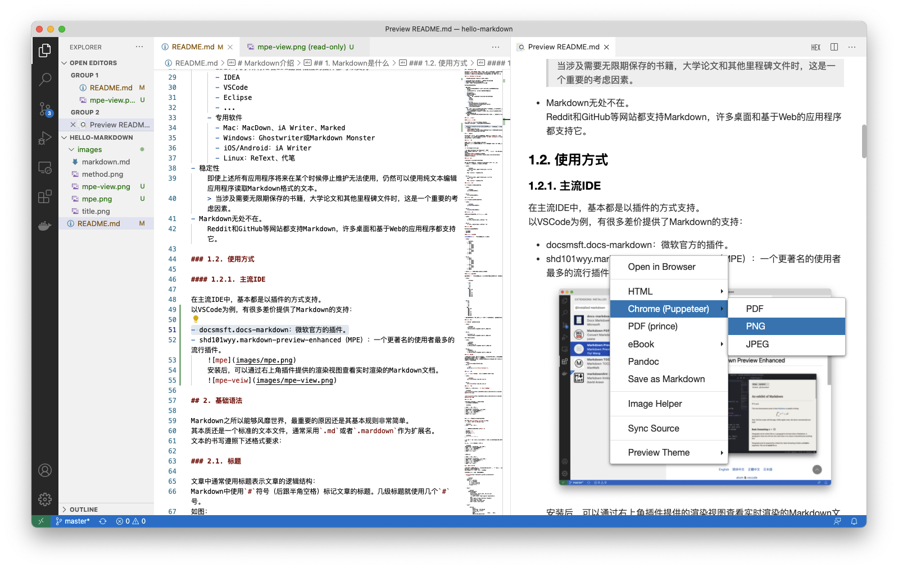
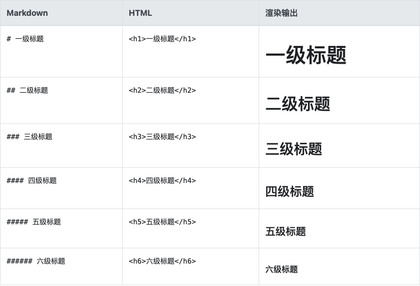
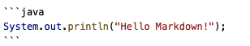

# Markdown介绍

[toc]

## 1. Markdown是什么

Markdown是一种轻量级的标记语言，可用于将格式设置元素添加到纯文本文档中。  
Markdown 由[John Gruber](https://daringfireball.net/projects/markdown/)于2004年创建，如今已成为世界上最受欢迎的标记语言之一。

### 1.1. Markdown vs 各路英豪

开始介绍Markdown之前，可能诸位有这些疑问：

> 我已经有MS Office Word了，为什么还要用Markdown？  
> PDF文件不好吗？为啥用Markdown？  
> 同样是标记语言Markdown比HTML好在哪里？  

Markdown文件的优点：

- 功能强大
    可以创建网站、文档、便笺、书籍、演示文稿、电子邮件等等。
- 简单明了
    基本语法规则非常简单，大多数人可以快速上手
- 开放性
  - 没有版权限制
  - 没有操作系统限制
  - 大量软件选择
    - IDE: 几乎所有知名IDE配合相应的插件都可以支持
      - IDEA
      - VSCode
      - Eclipse
      - ...
    - 专用软件
      - Mac：MacDown、iA Writer、Marked
      - Windows：Ghostwriter或Markdown Monster
      - iOS/Android：iA Writer
      - Linux：ReText、代笔
- 稳定性
    即使上述所有应用程序将来在某个时候停止维护无法使用，仍然可以使用纯文本编辑应用程序读取Markdown格式的文本。
    > 当涉及需要无限期保存的书籍，大学论文和其他里程碑文件时，这是一个重要的考虑因素。
- Markdown无处不在。
    Reddit和GitHub等网站都支持Markdown，许多桌面和基于Web的应用程序都支持它。

### 1.2. 使用方式

#### 1.2.1. VSCode + MPE

在主流IDE中，基本都是以插件的方式支持。
以VSCode为例，有很多差价提供了Markdown的支持，其中目前最有名的，当属插件`shd101wyy.markdown-preview-enhanced`(简称：MPE)。

MPE插件：  


安装后，可以通过右上角插件提供的渲染视图查看Markdown文档。
修改Markdown文件时，渲染视图会实时联动。  


在渲染视图上右击，可以将渲染好的Markdown文件保存成PDF等其他格式的文件。


#### 1.2.2 Gitlab

绝大多数代码托管网站，都原生支持Markdown文件作为项目的介绍文档。
包括：

- Github
- Gitlab
- Gitblit
- Gitee

这里以Gitlab为例：

在项目的根目录生成`README.md`的文件。
并将本文的内容拷贝进去。
在项目的主页面，Gitlab会直接根据`README.md`的内容生成项目介绍页面：

## 2. 基础语法

Markdown之所以能够风靡世界，最重要的原因还是其基本规则非常简单。
其本质还是一个标准的文本文件，通常采用`.md`或者`.marddown`作为扩展名。
文本的书写遵照下述格式要求：

### 2.1. 标题

文章中通常使用标题表示文章的逻辑结构：
Markdown中使用`#`符号（后跟半角空格）标记文章的标题。几级标题就使用几个`#`号。
如图：



> 有些功能在Markdown中的实现方法不止一种。  
例如标题级别也可以用下一行接续```-----```和```======```来实现，这里不一一介绍。  
有兴趣可以参考网络上大量的相关文档。  
例如：[Markdown百度百科](https://baike.baidu.com/item/markdown/3245829?fr=aladdin)

### 2.2. 段落

在Markdown中，普通文字直接书写。  

如果要像现在这样创建一个新的段落，两段文字中间留一个空行。
> 注意：空行中不要有空格/tab等任何字符。

- 示例：

    ```markdown
    一行文字，注意本行最末尾以两个半角空格结尾。  
    另起一行。

    另起一段，我是一个新的段落。
    ```

- 效果：    
    一行文字，注意本行最末尾以两个半角空格结尾。  
    另起一行。

    另起一段，我是一个新的段落。

### 2.2.1. 斜体

用`*`围起要用斜体表示的文字。

- 示例：

    ```markdown
    用*斜体*表示强调效果
    ```

- 效果：    
    用*斜体*表示强调效果

### 2.2.2. 粗体

用`**`围起要用粗体表示的文字。

- 示例：

    ```markdown
    用**粗体**表示强调效果
    ```

- 效果：    
    用**粗体**表示强调效果

### 2.2.3. 转义

想表示特殊字符的时候使用反斜线进行转义。

- 示例：

    ```markdown
    \# 虽然使用了“#”，但本行文字不是标题
    ```

- 效果：    
    \# 虽然使用了“#”，但本行文字不是标题

### 2.3. 列表

Markdown定义了两种列表：

- 有序列表
- 无序列表

#### 2.3.1. 有序列表

**有序列表**用`1.`开头（后面跟半角空格）如：

- 示例：

    ```markdown
    1. 阶段1
    1. 阶段2
        1. 步骤1
        1. 步骤2
        1. 步骤3
        1. 步骤4
    1. 阶段3
        1. 步骤1
        1. 步骤2
    1. 阶段4
    1. 阶段5
    ```

- 效果：  
    1. 阶段1
    1. 阶段2
        1. 步骤1
        1. 步骤2
        1. 步骤3
        1. 步骤4
    1. 阶段3
        1. 步骤1
        1. 步骤2
    1. 阶段4
    1. 阶段5

> 不必自行增加编号，渲染软件会自动编号。

#### 2.3.1. 无序列表

无序列表用`-`开头（后面跟半角空格）其余规则跟有序列表完全一致。如：

- 示例：

    ```markdown
    
    - 四季
      - 春
      - 夏
      - 秋
      - 冬
    - 星期
      - 星期日
      - 星期一
      - 星期二
      - 星期三
      - 星期四
      - 星期五
      - 星期六
    
    ```

- 效果：  
  - 四季
    - 春
    - 夏
    - 秋
    - 冬
  - 星期
    - 星期日
    - 星期一
    - 星期二
    - 星期三
    - 星期四
    - 星期五
    - 星期六

> 无序列表的引导标记也可以使用`+`或者`*`，但不推荐在一篇文章内混合使用。

### 2.4. 引用

用`>`表示引言、补充说明等。

- 示例：

    ```markdown
    鲁迅曾经说过：
    > 希望是附丽于存在的，有存在，便有希望，有希望，便是光明。
    ```

- 效果：  

    鲁迅曾经说过：
    > 希望是附丽于存在的，有存在，便有希望，有希望，便是光明。

引用是可以嵌套的：

- 示例：

    ```markdown
    前面写到：
    > 鲁迅曾经说过：
    >> 希望是附丽于存在的，有存在，便有希望，有希望，便是光明。
    ```

- 效果：  
    前面写到：
    > 鲁迅曾经说过：
    >> 希望是附丽于存在的，有存在，便有希望，有希望，便是光明。

### 2.5. 代码块

像源代码之类，需要原样展示，不需要进行解释的内容，可以使用代码块功能。
即将内容围在两组连续的\`\`\`符号之间
代码块后面可以跟随相应语言的名称，例如Java，在支持的软件中，会利用颜色字体等对关键字进行强调处理。

- 示例：
    
- 效果：  

    ```java
    System.out.println("Hello Markdown!");
    ```

### 2.6. 链接

使用```[标题](链接地址)```的格式，就可以实现超链接：

- 示例：

    ```markdown
    [大连华信](https://www.dhc.com.cn)
    ```

- 效果：  
    [大连华信](https://www.dhc.com.cn)

### 2.7. 图片

图片的格式和链接非常相似``````

```markdown

```


### 2.8. 表格

在Markdown中表示表格也是很方便的。
一个完整的表格例子如下：

```markdown

| 姓名 | 性别 | 工作 |
| :--- | ---: | :---: |
| 左对齐内容 | 右对齐内容 | 居中内容 |
| 唐僧 | 男 | 西天取经团队领导 |
| 孙悟空 | 男 | 护送唐僧 |
| 猪八戒 | 男 | 同上 |
| 沙僧 | 男 | 同上 |

```

表格使用`|`分割不同字段之间的内容。

表格分成`表头`、`对齐方式`、`内容`三部分。
第一行固定为`表头`，是表格的标题：

```markdown
| 姓名 | 性别 | 工作 |
```

第二行负责控制后面内容的`对齐方式`：

- 左对齐：`:---`
- 右对齐：`---:`
- 居中对齐：`:---:`

```markdown
| :--- | ---: | :---: |
```

> 其中的`---`不一定必须是三个，可以是一个或多个都可以。各个表格之间也不必一致。

从第三行开始是实际的表格`内容`：

```markdown
|左对齐内容 | 右对齐内容 | 居中内容 |
| 唐僧 | 男 | 西天取经团队领导 |
| 孙悟空 | 男 | 护送唐僧 |
| 猪八戒 | 男 | 同上 |
| 沙僧 | 男 | 同上 |
```

实际效果：

| 姓名 | 性别 | 工作 |
| :--- | ---: | :---: |
| 左对齐内容 | 右对齐内容 | 居中内容 |
| 唐僧 | 男 | 西天取经团队领导 |
| 孙悟空 | 男 | 护送唐僧 |
| 猪八戒 | 男 | 同上 |
| 沙僧 | 男 | 同上 |

## 3. 功能增强插件

在Markdown基础功能之上，基于Markdown良好的兼容性和开放性。好多开发者为Markdown开发了增强的功能。
这里以各种流程图为例，简单举几个例子。

以下例子都是用简单的几句代码生成：

- [mermaid](https://mermaid-js.github.io/mermaid/#/)
  - 流程图

    ```mermaid
    graph LR
    A[方形] -->B(圆角)
        B --> C{条件a}
        C -->|a=1| D[结果1]
        C -->|a=2| E[结果2]
        F[横向流程图]
    ```
  
  - 时序图
  
      ```mermaid
      sequenceDiagram
          autonumber
          Alice->>John: Hello John, how are you?
          loop Healthcheck
              John->>John: Fight against hypochondria
          end
          Note right of John: Rational thoughts!
          John-->>Alice: Great!
          John->>Bob: How about you?
          Bob-->>John: Jolly good!
      ```
  
  - 甘特图
  
      ```mermaid
              gantt
              dateFormat  YYYY-MM-DD
              title 软件开发甘特图
              section 设计
              需求                      :done,    des1, 2021-01-06,2021-01-08
              原型                      :active,  des2, 2021-01-09, 3d
              UI设计                     :         des3, after des2, 5d
          未来任务                     :         des4, after des3, 5d
              section 开发
              学习准备理解需求                      :crit, done, 2021-01-06,24h
              设计框架                             :crit, done, after des2, 2d
              开发                                 :crit, active, 3d
              未来任务                              :crit, 5d
              耍                                   :2d
              section 测试
              功能测试                              :active, a1, after des3, 3d
              压力测试                               :after a1  , 20h
              测试报告                               : 48h
      ```

## 4. 使用场景

### 4.1. 项目文档

目前比较流行的代码托管网站，基本都支持将项目根目录下的`README.md`作为项目的默认说明文档。
目前大家看到的这个文档效果，就是一个Gitlab项目的默认页面。
