#  Markdown介绍
  
  
- [Markdown介绍](#markdown介绍 )
  - [1. Markdown是什么](#1-markdown是什么 )
    - [1.1. Markdown vs 各路英豪](#11-markdown-vs-各路英豪 )
    - [1.2. 使用方式](#12-使用方式 )
      - [1.2.1. VSCode + MPE](#121-vscode-mpe )
      - [1.2.2 Gitlab](#122-gitlab )
  - [2. 基础语法](#2-基础语法 )
    - [2.1. 标题](#21-标题 )
    - [2.2. 段落](#22-段落 )
    - [2.2.1. 斜体](#221-斜体 )
    - [2.2.2. 粗体](#222-粗体 )
    - [2.2.3. 转义](#223-转义 )
    - [2.3. 列表](#23-列表 )
      - [2.3.1. 有序列表](#231-有序列表 )
      - [2.3.1. 无序列表](#231-无序列表 )
    - [2.4. 引用](#24-引用 )
    - [2.5. 代码块](#25-代码块 )
    - [2.6. 链接](#26-链接 )
    - [2.7. 图片](#27-图片 )
    - [2.8. 表格](#28-表格 )
  - [3. 功能增强插件](#3-功能增强插件 )
    - [3.1. 作图](#31-作图 )
      - [3.1.1. Mermaid](#311-mermaid )
    - [3.1.2. Markdown自动生成图片的优势](#312-markdown自动生成图片的优势 )
    - [3.2. TOC](#32-toc )
  - [4. 参考资料](#4-参考资料 )
  
##  1. Markdown是什么
  
  
Markdown是一种轻量级的标记语言，可用于将格式设置元素添加到纯文本文档中。  
Markdown 由[John Gruber](https://daringfireball.net/projects/markdown/ )于2004年创建，如今已成为世界上最受欢迎的标记语言之一。
  
###  1.1. Markdown vs 各路英豪
  
  
开始介绍Markdown之前，可能诸位有这些疑问：
  
> 我已经有MS Office Word了，为什么还要用Markdown？  
> PDF文件不好吗？为啥用Markdown？  
> 同样是标记语言Markdown比HTML好在哪里？  
  
Markdown文件的优点：
  
- 功能强大  
    可以创建网站、文档、便笺、书籍、演示文稿、电子邮件等等。
- 简单明了  
    基本语法规则非常简单，大多数人可以快速上手
- 开放性
  - 没有版权限制
  - 没有操作系统限制
  - 大量软件选择
    - IDE: 几乎所有知名IDE配合相应的插件都可以支持
      - IDEA
      - VSCode
      - Eclipse
      - ...
    - 专用软件
      - Mac：MacDown、iA Writer、Marked
      - Windows：Ghostwriter或Markdown Monster
      - iOS/Android：iA Writer
      - Linux：ReText、...
- 稳定性  
    即使上述所有应用程序将来在某个时候停止维护无法使用，仍然可以使用纯文本编辑应用程序读取Markdown格式的文本。
    > 当涉及需要无限期保存的书籍，大学论文和其他里程碑文件时，这是一个重要的考虑因素。
- Markdown无处不在。  
    Reddit和GitHub等网站都支持Markdown，许多桌面和基于Web的应用程序都支持它。
  
###  1.2. 使用方式
  
  
####  1.2.1. VSCode + MPE
  
  
在主流IDE中，基本都是以插件的方式支持。
以VSCode为例，有很多插件提供了Markdown的支持，其中目前最有名的，当属插件`shd101wyy.markdown-preview-enhanced`(简称：MPE)。
  
MPE插件：  
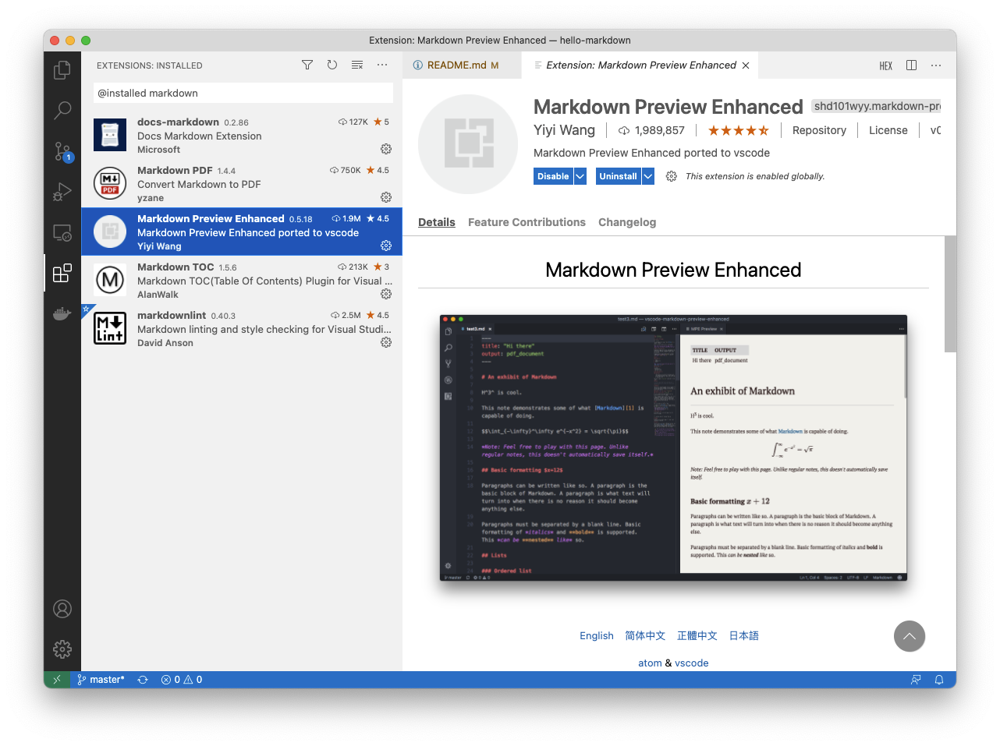
  
安装后，可以通过右上角插件提供的渲染视图查看Markdown文档。
修改Markdown文件时，渲染视图会实时联动。  
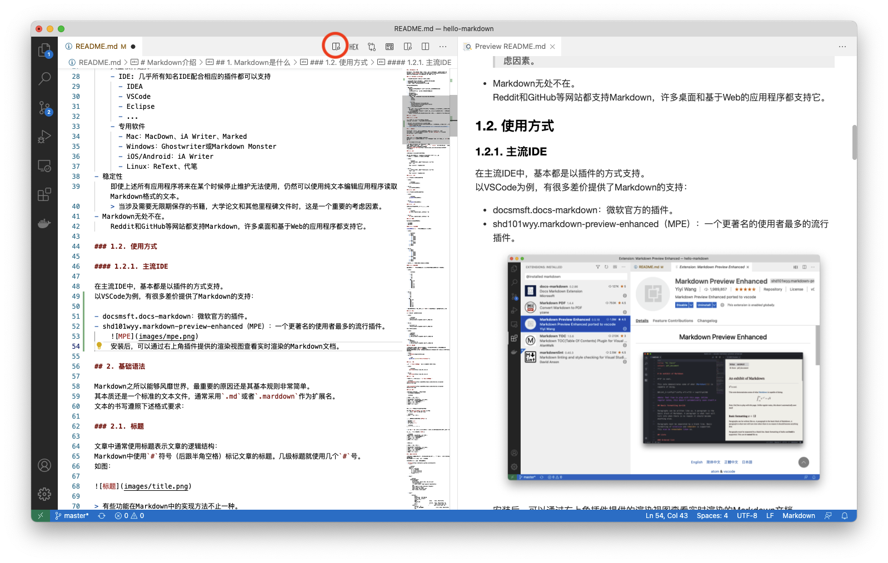
  
在渲染视图上右击，可以将渲染好的Markdown文件保存成PDF等其他格式的文件。
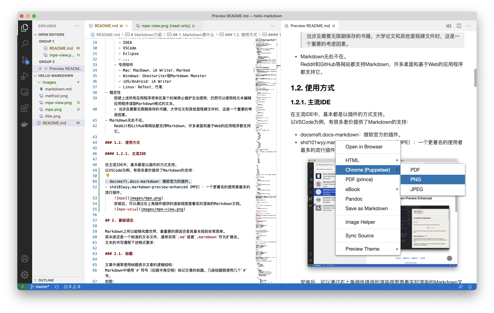
  
####  1.2.2 Gitlab
  
  
绝大多数代码托管网站，都原生支持Markdown文件作为项目的介绍文档。
包括：
  
- Github
- Gitlab
- Gitblit
- Gitee
- ...
  
这里以Gitlab为例：
  
在项目的根目录生成`README.md`的文件。
并将本文的内容拷贝进去。
  
- 在项目的主页面，Gitlab会直接根据`README.md`的内容生成项目介绍页面：  
    
- 在输入文字的界面（如Commit说明、Merge Request说明、issus说明等）也都支持Markdown  
    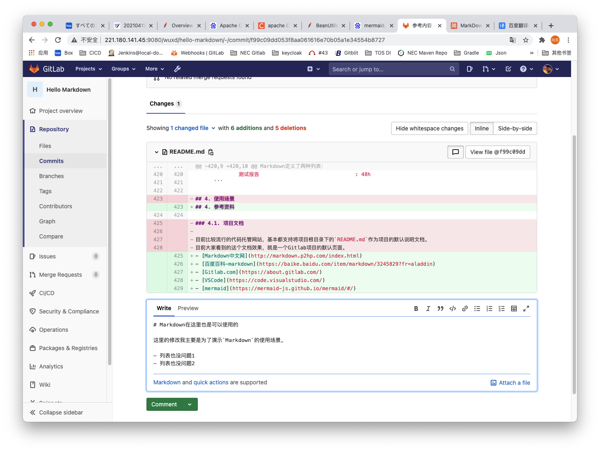  
    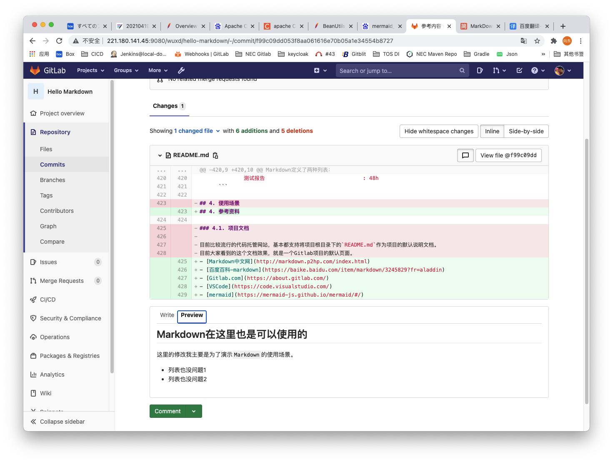  
    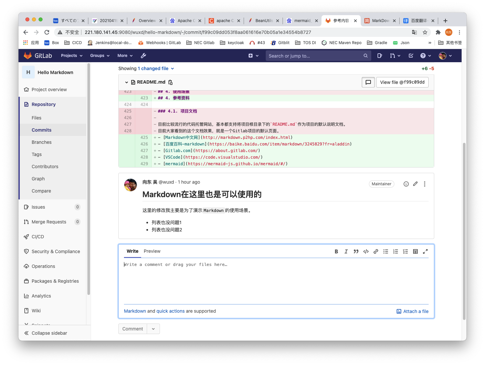
  
##  2. 基础语法
  
  
Markdown之所以能够风靡世界，最重要的原因还是其基本规则非常简单。  
其本质还是一个标准的文本文件，通常采用`.md`或者`.markdown`作为扩展名。  
文本的书写遵照下述格式要求：
  
###  2.1. 标题
  
  
文章中通常使用标题表示文章的逻辑结构：
Markdown中使用`#`符号（后跟半角空格）标记文章的标题。几级标题就使用几个`#`号。
如图：
  
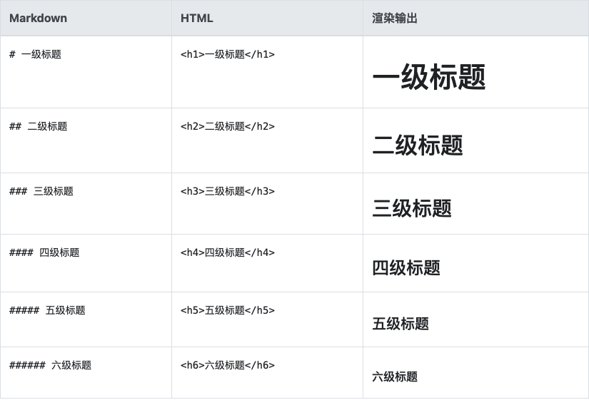
  
> 有些功能在Markdown中的实现方法不止一种。  
例如标题级别也可以用下一行接续```-----```和```======```来实现，这里不一一介绍。  
有兴趣可以参考网络上大量的相关文档。  
例如：[Markdown百度百科](https://baike.baidu.com/item/markdown/3245829?fr=aladdin )
  
###  2.2. 段落
  
  
在Markdown中，普通文字直接书写。  
  
如果要像现在这样创建一个新的段落，两段文字中间留一个空行。
> 注意：空行中不要有空格/tab等任何字符。  
在段落之中如果需要另起一行，除了正常的换行之外，在上一行的末尾要添加两个半角空格。
  
- 示例：
  
    ```markdown
    一行文字，注意本行最末尾以两个半角空格结尾。  
    另起一行。本行结尾没有两个空格，会和下一行合并显示。
    下一行文字。
  
    另起一段，我是一个新的段落。
    ```
  
- 效果：  
    一行文字，注意本行最末尾以两个半角空格结尾。  
    另起一行。本行结尾没有两个空格，会和下一行合并显示。
    下一行文字。
  
    另起一段，我是一个新的段落。
  
###  2.2.1. 斜体
  
  
用`*`围起要用斜体表示的文字。
  
- 示例：
  
    ```markdown
    用*斜体*表示强调效果
    ```
  
- 效果：  
    用*斜体*表示强调效果
  
###  2.2.2. 粗体
  
  
用`**`围起要用粗体表示的文字。
  
- 示例：
  
    ```markdown
    用**粗体**表示强调效果
    ```
  
- 效果：  
    用**粗体**表示强调效果
  
###  2.2.3. 转义
  
  
想表示特殊字符的时候使用反斜线进行转义。
  
- 示例：
  
    ```markdown
    \# 虽然使用了“#”，但本行文字不是标题
    ```
  
- 效果：    
    \# 虽然使用了“#”，但本行文字不是标题
  
###  2.3. 列表
  
  
Markdown定义了两种列表：
  
- 有序列表
- 无序列表
  
####  2.3.1. 有序列表
  
  
**有序列表**用`1.`开头（后面跟半角空格）如：
  
- 示例：
  
    ```markdown
    1. 阶段1
    1. 阶段2
        1. 步骤1
        1. 步骤2
        1. 步骤3
        1. 步骤4
    1. 阶段3
        1. 步骤1
        1. 步骤2
    1. 阶段4
    1. 阶段5
    ```
  
- 效果：  
    1. 阶段1
    1. 阶段2
        1. 步骤1
        1. 步骤2
        1. 步骤3
        1. 步骤4
    1. 阶段3
        1. 步骤1
        1. 步骤2
    1. 阶段4
    1. 阶段5
  
> 不必自行增加编号，渲染软件会自动编号。
  
####  2.3.1. 无序列表
  
  
无序列表用`-`开头（后面跟半角空格）其余规则跟有序列表完全一致。如：
  
- 示例：
  
    ```markdown
  
    - 四季
      - 春
      - 夏
      - 秋
      - 冬
    - 星期
      - 星期日
      - 星期一
      - 星期二
      - 星期三
      - 星期四
      - 星期五
      - 星期六
  
    ```
  
- 效果：  
  - 四季
    - 春
    - 夏
    - 秋
    - 冬
  - 星期
    - 星期日
    - 星期一
    - 星期二
    - 星期三
    - 星期四
    - 星期五
    - 星期六
  
> 无序列表的引导标记也可以使用`+`或者`*`，但不推荐在一篇文章内混合使用。
  
###  2.4. 引用
  
  
用`>`表示引言、补充说明等。
  
- 示例：
  
    ```markdown
    鲁迅曾经说过：
    > 希望是附丽于存在的，有存在，便有希望，有希望，便是光明。
    ```
  
- 效果：  
  
    鲁迅曾经说过：
    > 希望是附丽于存在的，有存在，便有希望，有希望，便是光明。
  
引用是可以嵌套的：
  
- 示例：
  
    ```markdown
    前面写到：
    > 鲁迅曾经说过：
    >> 希望是附丽于存在的，有存在，便有希望，有希望，便是光明。
    ```
  
- 效果：  
    前面写到：
    > 鲁迅曾经说过：
    >> 希望是附丽于存在的，有存在，便有希望，有希望，便是光明。
  
###  2.5. 代码块
  
  
像源代码之类，需要原样展示，不需要进行解释的内容，可以使用代码块功能。
即将内容围在两组连续的\`\`\`符号之间
代码块后面可以跟随相应语言的名称，例如Java，在支持的软件中，会利用颜色字体等对关键字进行强调处理。
  
- 示例：
    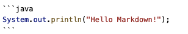
- 效果：  
  
    ```java
    System.out.println("Hello Markdown!");
    ```
  
###  2.6. 链接
  
  
使用```[标题](链接地址 )```的格式，就可以实现超链接：
  
- 示例：
  
    ```markdown
    [大连华信](https://www.dhc.com.cn)
    ```
  
- 效果：  
    [大连华信](https://www.dhc.com.cn )
  
###  2.7. 图片
  
  
图片的格式和链接非常相似``````
  
```markdown

```
  

  
###  2.8. 表格
  
  
在Markdown中表示表格也是很方便的。
一个完整的表格例子如下：
  
```markdown
  
| 姓名 | 性别 | 工作 |
| :--- | ---: | :---: |
| 左对齐内容 | 右对齐内容 | 居中内容 |
| 唐僧 | 男 | 西天取经团队领导 |
| 孙悟空 | 男 | 护送唐僧 |
| 猪八戒 | 男 | 同上 |
| 沙僧 | 男 | 同上 |
  
```
  
表格使用`|`分割不同字段之间的内容。
  
表格分成`表头`、`对齐方式`、`内容`三部分。
第一行固定为`表头`，是表格的标题：
  
```markdown
| 姓名 | 性别 | 工作 |
```
  
第二行负责控制后面内容的`对齐方式`：
  
- 左对齐：`:---`
- 右对齐：`---:`
- 居中对齐：`:---:`
  
```markdown
| :--- | ---: | :---: |
```
  
> 其中的`---`不一定必须是三个，可以是一个或多个都可以。各个表格之间也不必一致。
  
从第三行开始是实际的表格`内容`：
  
```markdown
|左对齐内容 | 右对齐内容 | 居中内容 |
| 唐僧 | 男 | 西天取经团队领导 |
| 孙悟空 | 男 | 护送唐僧 |
| 猪八戒 | 男 | 同上 |
| 沙僧 | 男 | 同上 |
```
  
实际效果：
  
| 姓名 | 性别 | 工作 |
| :--- | ---: | :---: |
| 左对齐内容 | 右对齐内容 | 居中内容 |
| 唐僧 | 男 | 西天取经团队领导 |
| 孙悟空 | 男 | 护送唐僧 |
| 猪八戒 | 男 | 同上 |
| 沙僧 | 男 | 同上 |
  
##  3. 功能增强插件
  
  
在Markdown基础功能之上，基于Markdown良好的兼容性和开放性，好多开发者为Markdown开发了增强的功能。
  
###  3.1. 作图
  
  
Markdown的作图增强语法插件有很多，最著名的有[Mermaid](https://mermaid-js.github.io/mermaid/#/ )、Sequence和Flow。  
下面以Mermaid为例，简单显示几个作图的例子。
  
####  3.1.1. Mermaid
  
  
[Mermaid](https://mermaid-js.github.io/mermaid/#/ )是一个基于Javascript的图表和图表工具，可以呈现基于Markdown的文本定义来动态地创建和修改图表。  
它允许您使用文本和代码创建图表，简化了复杂图表的维护。  
  
- 流程图
  

```
Error: mermaid CLI is required to be installed.
Check https://github.com/mermaid-js/mermaid.cli for more information.

Error: Command failed: npx mmdc --theme default --input /var/folders/lr/cbtbvfp57dxb3f2kf17h4p3h0000gn/T/mume-mermaid2021321-18628-1s9qkwm.b3wv.mmd --output /Users/wuxd/work/Learn/markdown/git/hello-markdown/assets/77f10da20ecb6c27e463360d4613e9400.png
/bin/sh: npx: command not found

```  

  
- 时序图
  

```
Error: mermaid CLI is required to be installed.
Check https://github.com/mermaid-js/mermaid.cli for more information.

Error: Command failed: npx mmdc --theme default --input /var/folders/lr/cbtbvfp57dxb3f2kf17h4p3h0000gn/T/mume-mermaid2021321-18628-xh3qm.ktac2.mmd --output /Users/wuxd/work/Learn/markdown/git/hello-markdown/assets/77f10da20ecb6c27e463360d4613e9401.png
/bin/sh: npx: command not found

```  

  
- 甘特图
  

```
Error: mermaid CLI is required to be installed.
Check https://github.com/mermaid-js/mermaid.cli for more information.

Error: Command failed: npx mmdc --theme default --input /var/folders/lr/cbtbvfp57dxb3f2kf17h4p3h0000gn/T/mume-mermaid2021321-18628-1yzfpkn.cxvj.mmd --output /Users/wuxd/work/Learn/markdown/git/hello-markdown/assets/77f10da20ecb6c27e463360d4613e9402.png
/bin/sh: npx: command not found

```  

  
###  3.1.2. Markdown自动生成图片的优势
  
  
实际使用中最方便的是，简单的修改Markdown的文本，图中相应的内容就可以实时跟随变化。  
如下图，不管是增加元素还是调整流程图的方向，右侧的图片都实时做出了反应。  
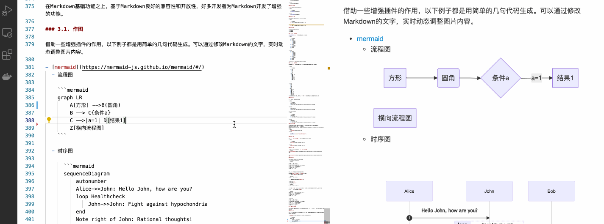
  
###  3.2. TOC
  
  
在文章的开头生成整篇文章的索引可以有助于读者快速了解文章的主要脉络，并快速定位到自己需要的内容。  
但是手动维护目录是一件费时费力还不讨好的工作。有幸的是VSCode插件`alanwalk.markdown-toc`可以帮助我们快速自动的实现这个过程。
  
- 使用方法
  1. 在VSCode中安装TOC插件
      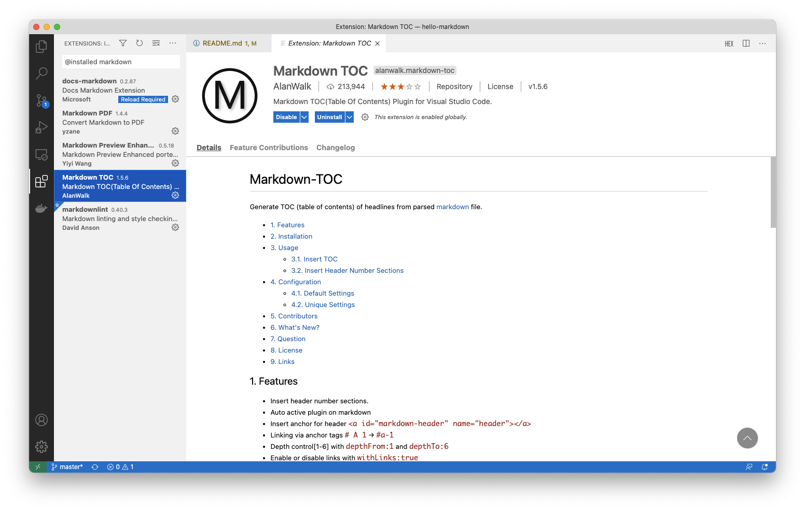
  1. 在希望插入目录的位置输入：`[TOC]`
- 效果  
    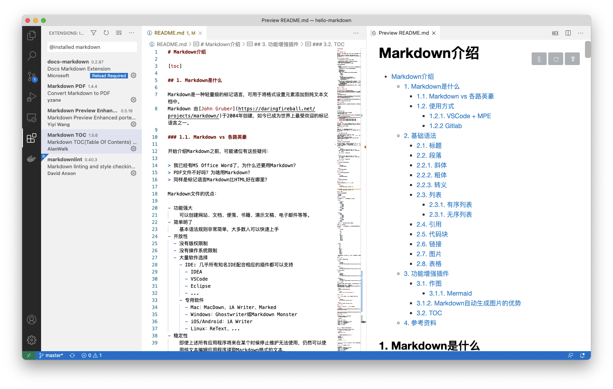
  
##  4. 参考资料
  
  
- [Markdown中文网](http://markdown.p2hp.com/index.html )
- [百度百科-markdown](https://baike.baidu.com/item/markdown/3245829?fr=aladdin )
- [Gitlab.com](https://about.gitlab.com/ )
- [VSCode](https://code.visualstudio.com/ )
- [mermaid](https://mermaid-js.github.io/mermaid/#/ )
  